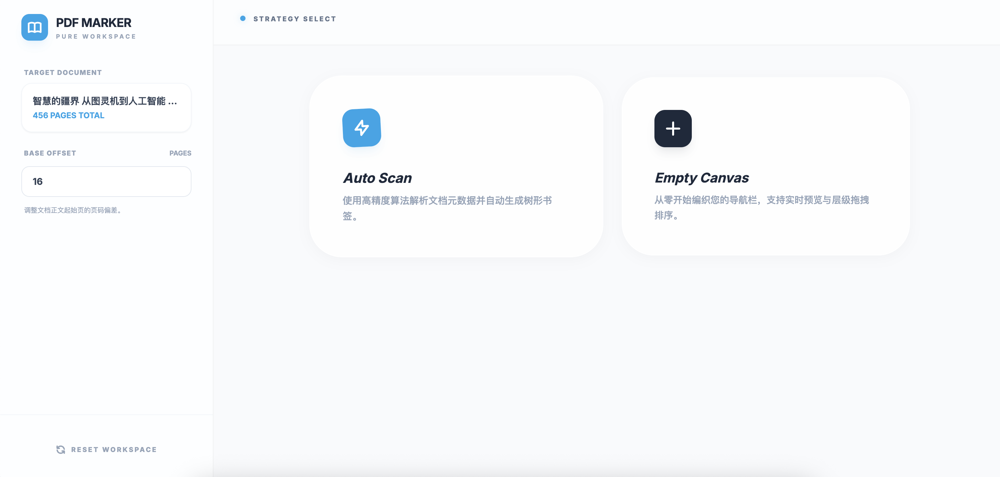
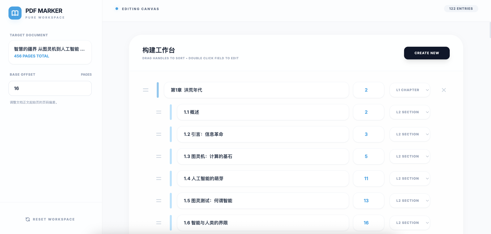

# PDF Marker | 智能 PDF 目录编辑器

一个现代、纯净且高效的 PDF 目录（书签）工作台。支持智能自动扫描和灵活的手动编辑，助您快速为 PDF 文档构建完美的索引体系。



## ✨ 核心特性

- 🤖 **智能目录提取**：内置高精度算法，一键扫描文档前 20 页并自动识别潜在层级结构。
- 🖱️ **自由拖拽排序**：支持通过手柄直接拖拽调整目录顺序，所见即所得。
- 📐 **多层级支持**：支持三级目录结构（章、节、点），轻松应对复杂文档。
- 🔢 **页码偏置修正**：自适应纸质页码与电子页码的偏差，确保跳转精准无误。
- 📁 **本地化存储**：尊重隐私，文件处理完成后自动清理服务器残留。



## 🚀 快速开始

### 本地运行

1. **克隆仓库**
   ```bash
   git clone <your-repo-url>
   cd pdf-editor
   ```

2. **安装依赖**
   ```bash
   pip install -r requirements.txt
   ```

3. **启动服务**
   ```bash
   python app.py
   ```
   访问 `http://127.0.0.1:5000` 即可开始使用。

### Docker 部署

1. **拉取镜像** (推荐)
   ```bash
   docker pull ghcr.io/jiangnan1224/pdf-toc-editor:latest
   ```

2. **运行容器**
   ```bash
   docker run -d -p 5000:5000 --name pdf-toc-editor ghcr.io/jiangnan1224/pdf-toc-editor:latest
   ```
   访问 `http://localhost:5000`。

## 🛠️ 技术栈

- **后端**: Python (Flask), pypdf
- **前端**: HTML5, Vanilla JavaScript, Tailwind CSS (Style Engine)
- **容器化**: Docker, GitHub Actions (CI/CD)

## ⚖️ 许可

[MIT License](LICENSE)
